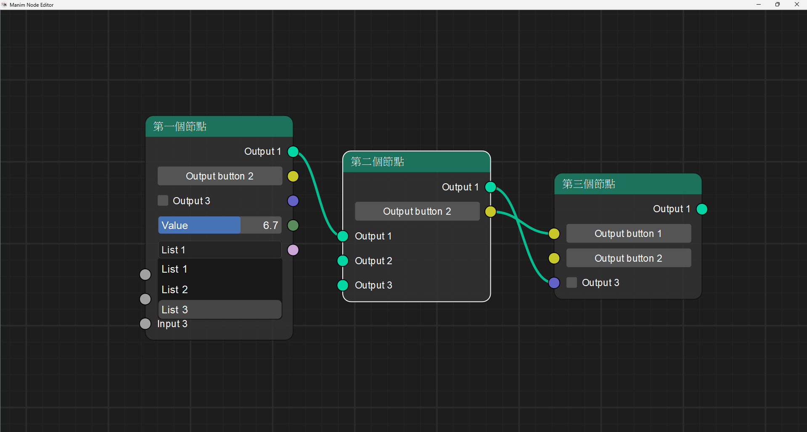

# Manim Community 節點編輯器

_期待可以做出一個國中生也能輕鬆遊玩並做出屬於自己的數學動畫製作軟體_
## 資料夾說明
* app - 主資料夾
* common - 常用設定資料夾
  * color_sheet.py - 獲取顏色列表
  * performance_utils.py - 自製運行測試時間
  * style_sheet.py - 獲取自製樣式表
* components - 小部件樣式資料夾
  * node_checkbox.py , node_comboBox.py , ... -  重新繪製小部件
* config - 基礎設定資料夾
  * debug.py - 控制各檔案開發模式
  * file_path.py - 各路徑獲取
  * icon.py - 圖標路徑
* data - 資料儲存
  * graph.json - 序列化場景資料
* NodeEditor - 節點編輯器主資料夾
  * Edge - 線段資料夾
    * node_Edge.py - 線段基本構造
    * node_GraphicsEdge.py - 線段樣式構造
  * Node - 節點資料夾
    * node_ContentWidget.py - 節點內部小部件樣式
    * node_GraphicsNode.py -節點樣式構造
    * node_Node.py - 節點基本構造
  * Other - 其他資料夾
    * node-Cutline.py - 切除線段
  * Serialization - 序列化資料夾
    * node_Serializable.py - 序列化架構
  * Socket - 連結點資料夾
    * node_Socket.py - 連結點基本構造
    * node_GraphicsSocket.py - 連結點樣式構造
  * nodeEditor_GraphicsView.py - 主畫面控制，含按鍵事件
  * nodeEditor_Scene.py - 節點編輯器畫面
  * nodeEditor_Window.py - 節點編輯器視窗
* resources - 材質包
  * color - 顏色資料夾
  * icons - 圖標資料夾
  * qss - QSS 樣式資料夾
  * screenshot - 螢幕截圖資料夾
* main.py - 主運行程式

## 進度
> 參考影片清單：[https://www.youtube.com/watch?v=xbTLhMJARrk&list=PLZSNHzwDCOggHLThIbCxUhWTgrKVemZkz](https://www.youtube.com/watch?v=xbTLhMJARrk&list=PLZSNHzwDCOggHLThIbCxUhWTgrKVemZkz)

### 目前進度截圖
#### 2024.04.08

### 影片練習觀看進度

第一部分：節點編輯器架構

* [ ] [Node Editor in Python Tutorial Series: Introduction](https://www.youtube.com/watch?v=xbTLhMJARrk&list=PLZSNHzwDCOggHLThIbCxUhWTgrKVemZkz) (跳過)
* [ ] [Node Editor 00: Prerequisities - How to setup PyCharm](https://www.youtube.com/watch?v=YV1mEYd7nyM&list=PLZSNHzwDCOggHLThIbCxUhWTgrKVemZkz&index=2) (跳過)
* [x] [Node Editor Tutorial 01: How to create View, Scene and Grid Background](https://www.youtube.com/watch?v=YKpInnvaM-M&list=PLZSNHzwDCOggHLThIbCxUhWTgrKVemZkz&index=3)
* [x] [Node Editor Tutorial 02: How to add items to GraphicsView](https://www.youtube.com/watch?v=kvZVwaZ3WZE&list=PLZSNHzwDCOggHLThIbCxUhWTgrKVemZkz&index=4)
* [x] [Node Editor Tutorial 03: How to navigate scene](https://www.youtube.com/watch?v=5IKOIOg76so&list=PLZSNHzwDCOggHLThIbCxUhWTgrKVemZkz&index=5)
* [x] [Node Editor Tutorial 04: Implementing Scene](https://www.youtube.com/watch?v=MO2ptcCyacY&list=PLZSNHzwDCOggHLThIbCxUhWTgrKVemZkz&index=6)
* [x] [Node Editor Tutorial 05: How to implement Node](https://www.youtube.com/watch?v=CW6QQgUk2qI&list=PLZSNHzwDCOggHLThIbCxUhWTgrKVemZkz&index=7)
* [x] [Node Editor Tutorial 06: Implementing Node Content](https://www.youtube.com/watch?v=YaX8ZQnBgcc&list=PLZSNHzwDCOggHLThIbCxUhWTgrKVemZkz&index=8)
* [x] [Node Editor Tutorial 07: How to implement Sockets](https://www.youtube.com/watch?v=Rs5-Se2F3j8&list=PLZSNHzwDCOggHLThIbCxUhWTgrKVemZkz&index=9)
* [x] [Node Editor Tutorial 08: How to implement Edges](https://www.youtube.com/watch?v=Bis2KcGLfI4&list=PLZSNHzwDCOggHLThIbCxUhWTgrKVemZkz&index=10)
* [x] [Node Editor Tutorial 09: Positioning Edges and Debugging](https://www.youtube.com/watch?v=OPFloSj4GdE&list=PLZSNHzwDCOggHLThIbCxUhWTgrKVemZkz&index=11)
* [x] [Node Editor Tutorial 10: Finishing Edges and Socket Variations](https://www.youtube.com/watch?v=AoSKt36k9bk&list=PLZSNHzwDCOggHLThIbCxUhWTgrKVemZkz&index=12)
* [x] [Node Editor Tutorial 11: How to create Dragging Edge](https://www.youtube.com/watch?v=pk4v2xuXlm4&list=PLZSNHzwDCOggHLThIbCxUhWTgrKVemZkz&index=13)
* [x] [Node Editor Tutorial 12: Finishing Dragging Edge](https://www.youtube.com/watch?v=-VYcQojkloE&list=PLZSNHzwDCOggHLThIbCxUhWTgrKVemZkz&index=14)
* [x] [Node Editor Tutorial 13: How to implement Selecting Items](https://www.youtube.com/watch?v=efvvJHHLWxA&list=PLZSNHzwDCOggHLThIbCxUhWTgrKVemZkz&index=15)
* [x] [Node Editor Tutorial 14: Implementing Deleting Items](https://www.youtube.com/watch?v=POiyj0CbUpI&list=PLZSNHzwDCOggHLThIbCxUhWTgrKVemZkz&index=16)
* [x] [Node Editor Tutorial 15: Cutting Edges](https://www.youtube.com/watch?v=kH3s2ALpcLo&list=PLZSNHzwDCOggHLThIbCxUhWTgrKVemZkz&index=17)

第二部分：節點編輯器功能

* [x] [Node Editor Tutorial 16: Introduction to Serialization](https://www.youtube.com/watch?v=CNyHqmE5KoU&list=PLZSNHzwDCOggHLThIbCxUhWTgrKVemZkz&index=18)
* [x] [Node Editor Tutorial 17: Deserialization - File load](https://www.youtube.com/watch?v=R3Qh_JEnCoQ&list=PLZSNHzwDCOggHLThIbCxUhWTgrKVemZkz&index=19)
* [x] [Node Editor Tutorial 18: Undo & Redo #1 - Introduction](https://www.youtube.com/watch?v=dsgLJWBE_Lg&list=PLZSNHzwDCOggHLThIbCxUhWTgrKVemZkz&index=20)
* [x] [Node Editor Tutorial 19: Undo & Redo #2 - History Stack](https://www.youtube.com/watch?v=cWnrLndefPA&list=PLZSNHzwDCOggHLThIbCxUhWTgrKVemZkz&index=21)
* [x] [Node Editor Tutorial 20: Undo & Redo #3 - History Stamps](https://www.youtube.com/watch?v=ggFhdzPihzU&list=PLZSNHzwDCOggHLThIbCxUhWTgrKVemZkz&index=22)
* [x] [Node Editor Tutorial 21: How to implement Main Window with Menu](https://www.youtube.com/watch?v=1pbGasGZEbo&list=PLZSNHzwDCOggHLThIbCxUhWTgrKVemZkz&index=23)
* [x] [Node Editor Tutorial 22: How to implement Clipboard Operations](https://www.youtube.com/watch?v=ZW93RKjEWLM&list=PLZSNHzwDCOggHLThIbCxUhWTgrKVemZkz&index=24)
* [x] [Node Editor Tutorial 23: How to implement Clipboard Serialization](https://www.youtube.com/watch?v=PdqCogmBeXI&list=PLZSNHzwDCOggHLThIbCxUhWTgrKVemZkz&index=25)
* [ ] [Node Editor Tutorial 24: Bugfixing Crashes, Missing Edge](https://www.youtube.com/watch?v=FPP4RcGeQpU&list=PLZSNHzwDCOggHLThIbCxUhWTgrKVemZkz&index=26)
* [ ] [Node Editor Tutorial 25: Adding File Has Changed Dialog](https://www.youtube.com/watch?v=hxqDA1UQ03c&list=PLZSNHzwDCOggHLThIbCxUhWTgrKVemZkz&index=27)
* [ ] [Node Editor Tutorial 26: Socket with multiple Edges](https://www.youtube.com/watch?v=sKzNjQb3eWA&list=PLZSNHzwDCOggHLThIbCxUhWTgrKVemZkz&index=28)
* [ ] [Node Editor Tutorial 27: How to set up python package with tests and docs](https://www.youtube.com/watch?v=KPfrK8Smwrs&list=PLZSNHzwDCOggHLThIbCxUhWTgrKVemZkz&index=29)

第三部分：節點編輯器進階功能

* [ ] [Node Editor Tutorial 28: Calculator Example Introduction](https://www.youtube.com/watch?v=CQHqzVwXPVo&list=PLZSNHzwDCOggHLThIbCxUhWTgrKVemZkz&index=30)

---

### 已知程式錯誤：
* [X] ~~BUG.0.0.001：已互相連結之線段若重複連線會造成程序崩潰閃退~~
* [ ] BUG.0.0.002：滑鼠鼠標樣式錯誤
  * [ ] BUG.0.0.002A：在節點內部使用滑鼠中鍵移動視窗時，放開滑鼠並移動到節點外部時鼠標樣式仍保持移動時樣式(放大視窗到最大時較明顯)
  * [X] ~~BUG.0.0.002B:點擊 Ctrl+RMB(滑鼠右鍵) 結束後，若點擊 MMB(滑鼠中鍵)，則會使鼠標形狀改變為切割線段時的樣式(十字形)~~
* [X] ~~BUG.0.0.003：當視窗放大最大時，有機率無法自連接點延伸出線段 ( 更新：仍會產生線段，但需重新縮放視窗才可顯示 )~~
* [X] ~~BUG.0.0.004：選取多個物件功能時常失效 ( 更新：移動視窗後會失效 )~~
* [ ] BUG.0.0.005：當滑鼠在物件上顯示提示詞框與在其他物件之間切換時，提示字框大小會改變成較小樣式。
* [ ] BUG.0.0.006：內部元件經由讀取檔案重新載入後，其元件間隔會變小。( 更新：已發現問題，複製節點並非完全複製，僅以基礎模板重新建立節點 )
* [ ] BUG.0.0.007：若多次自連結點拉取線段卻並未連結時，會有機率發生未知閃退

### 已知代待修改錯誤：
* [ ] COD.0.0.001：`node_node / node_GraphicsNode.py` 節點高度決定位置與預計不符
  > 預期計畫：新增可控制型向量類型，將會改變節點高度
* [x] ~~COD.0.0.002：`node_node / node_Node.py` 節點內部滑桿內容尚未完善~~
* [ ] COD.0.0.003：`node_node / node_GraphicsNode.py` 下拉式選單預設高度較進度條小，目前暫時使用另定義高度解決。
* [ ] COD.0.0.004：歷史紀錄並未於程式開始運行時儲存，無法回復至開始程式時初始狀態